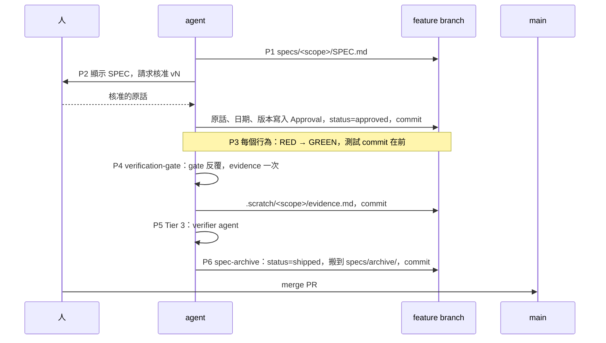

# Evidence-first：觸發方式與流程

這份文件給人讀。agent 讀的是合約（`~/.claude/CLAUDE.md`）與參考實作
（`~/.agents/workflows/evidence-first.md`）。兩者有衝突時，以那兩份為準。

## 1. 這是什麼

Evidence-first 是一份合約。它要求 repo 在變更完成時帶著五個屬性，讓驗證步驟從 git
讀證據，不從對話讀：

1. SPEC 在實作前由人核准並提交。
2. 測試的 commit 早於它覆蓋的實作 commit。
3. 每個新測試都先被觀察到失敗（RED）。
4. SPEC 宣告 tier。Tier 3 另附失效模型。
5. 全程遵守 anti-gaming：改實作不改測試、只報告真的跑過的檢查。

## 2. 觸發方式

沒有指令。合約隨 `~/.claude/CLAUDE.md` 進入每一個 session，由 agent 依條件判斷。

| 條件 | 結果 |
|---|---|
| 使用者要求高確信度：「prove it works」「TDD」「我不會看 code」 | 進入 evidence-first |
| 變更觸及金錢、認證、資料遺失、並行、公開 API | 進入 evidence-first |
| 其餘 | 一般流程：直接寫好測試，忽略合約 |

專案的 `AGENTS.md` 或 `CLAUDE.md` 可以覆寫合約。覆寫不能沉默：agent 要說一次，evidence
要記 `contract: overridden by <path>`。

實作工具不限。`/tdd`、spec-kitty、手工都可以。沒有工具合用時，照參考實作走。

## 3. 人介入的兩個點

1. **核准 SPEC**。每一版都要核准。agent 把核准的原話、日期、版本逐字寫進 SPEC 的
   Approval 一節，與 SPEC 一起提交。回答問題不算核准。SPEC 改過就回到
   `revised-pending-approval`，要重新核准才能繼續實作。
2. **合併 PR**。合併前，SPEC 已經封存為 `shipped`。

其餘步驟由 agent 執行，由腳本擋。

## 4. 六個 Phase

| Phase | 做什麼 | 產物 | 機械檢查 |
|---|---|---|---|
| 1 SPEC | 把需求寫成可執行的驗收條件：tier、scenarios、Must NOT、setup plan | `specs/<scope>/SPEC.md` | 路徑固定。`spec-archive` 只認這個路徑 |
| 2 SPEC REVIEW | 給人看 SPEC，取得核准，逐字記錄，`status` 改為 `approved`，提交 | SPEC 的 Approval 一節 | `spec-archive` 拒絕非 `approved` 的 SPEC |
| 3 IMPLEMENT | 每個行為：RED → GREEN → REFACTOR。測試先提交 | 測試與實作的 commit | gate 從 git 重建 RED 與 commit 順序 |
| 4 VERIFY | 呼叫 `verification-gate` skill。`gate` 反覆修，`evidence` 只跑一次 | `.scratch/<scope>/evidence.md`（本 repo 的慣例） | gate 任一層失敗即擋住 done。intent 標頭由 gate 從 SPEC 導出 |
| 5 INDEPENDENT VERIFICATION | Tier 3 選項。派 `verifier` agent，只給四項輸入，不給對話 | findings 與處置 | — |
| 6 CLOSE | 呼叫 `spec-archive` skill。`status` 改為 `shipped`，搬到 `specs/archive/<scope>/`，提交。這是分支最後一個 commit，在合併之前 | `specs/archive/<scope>/SPEC.md` | 工作樹不乾淨、SPEC 未核准、evidence 缺少或版本不符，一律拒絕 |



## 5. 產物與路徑

| 產物 | 路徑 | 說明 |
|---|---|---|
| SPEC | `specs/<scope>/SPEC.md` | 合約固定。範本在 `~/.agents/workflows/templates/spec.md` |
| 封存後的 SPEC | `specs/archive/<scope>/SPEC.md` | 由 `spec-archive` 搬移，不可手動 |
| Evidence | `.scratch/<scope>/evidence.md` | 本 repo 的慣例。放在 `specs/` 之外，因為封存會搬整個目錄 |
| Gate 產出 | `.gate/<scope>/` | 在 `.gitignore`。每次 gate 開頭清空 |
| Gate 入口 | `tools/gate.sh` | 本 repo 的入口。其他 repo 由 `verification-gate` 建立 |

## 6. 哪些是機械擋住的

流程只在腳本拒絕的那些點有約束力。寫成文字的規則，agent 會漏。

| 機械擋住 | 靠文字 |
|---|---|
| `spec-archive` 拒絕：非 approved、樹不乾淨、已封存、evidence 缺少或 `spec_version` 不符 | 先核准再實作 |
| `spec-archive --check` 在預設分支上遇到 approved 的 SPEC，exit 1 | RED 要親眼看到 |
| `gate.sh` 任一層失敗即停，manifest 稽核確認每層都跑過 | 改實作不改測試 |
| `gate-intent.sh` 從 SPEC 導出 intent 標頭 | evidence 只跑一次 |
| `tests/check_agent_doc_invariants.py` 守住合約、workflow、skill 之間的承諾 | 未授權不動手 |

右欄的每一條，在 windows-support 這次都至少漏過一次。要加約束，加在左欄。

## 7. 指令速查

```sh
# 找漏做的 CLOSE。feature branch 上列候選；main 上遇到 approved 直接 exit 1
python3 ~/.agents/skills/spec-archive/scripts/spec-archive.py --check

# 封存（在 feature branch，gate 的 evidence 之後，合併之前）
python3 ~/.agents/skills/spec-archive/scripts/spec-archive.py <scope>

# 本 repo 的 gate 入口。evidence 的每個數字都來自它的同一次執行
sh tools/gate.sh

# 合約與 skill 之間的跨檔承諾
python3 tests/check_agent_doc_invariants.py
python3 tests/spec_archive_test.py
```

## 8. 安裝位置

由本 repo 經 chezmoi 產生：

| 來源 | 目標 |
|---|---|
| `.chezmoitemplates/evidence-first-contract.md`（經 `agent-instructions.md`） | `~/.claude/CLAUDE.md`、`~/.codex/AGENTS.md` |
| `dot_agents/workflows/evidence-first.md` | `~/.agents/workflows/evidence-first.md` |
| `dot_agents/skills/verification-gate/` | `~/.agents/skills/verification-gate/` |
| `dot_agents/skills/spec-archive/` | `~/.agents/skills/spec-archive/` |
| `dot_claude/agents/verifier.md.tmpl`、`dot_codex/agents/verifier.toml.tmpl` | `~/.claude/agents/verifier.md`、`~/.codex/agents/verifier.toml` |

合約版本：v0.6。第一個走完整流程的變更是 `windows-support`，其 evidence 在
[.scratch/windows-support/evidence.md](../.scratch/windows-support/evidence.md)，封存的 SPEC 在
[specs/archive/windows-support/SPEC.md](../specs/archive/windows-support/SPEC.md)。
